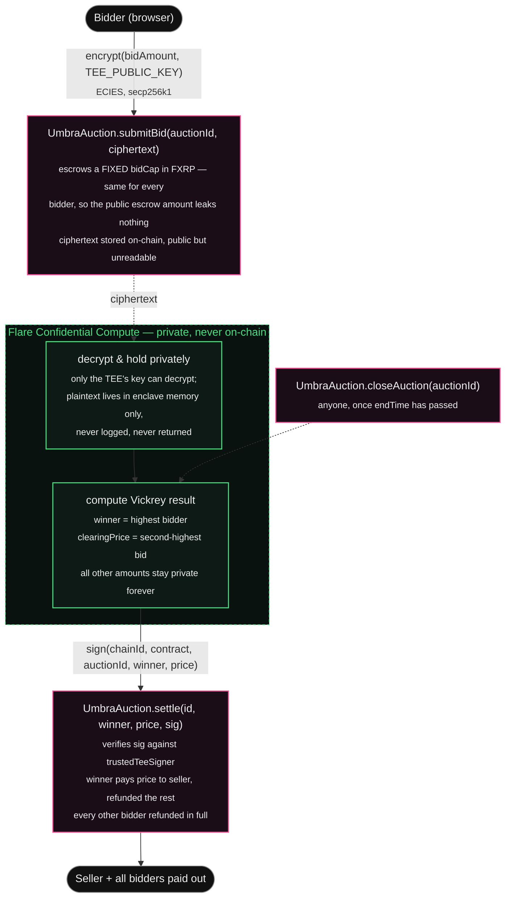

# Umbra

Sealed-bid (Vickrey / second-price) auctions on Flare, with bid amounts kept private through Flare Confidential Compute (FCC).

Submitting to the **Flare Summer Signal** hackathon's **Confidential Compute Apps** track.

## Architecture



## Why confidential compute, not a normal contract

Calldata and contract storage are public. A plain smart contract sealed-bid
auction leaks every bid the instant it's submitted — the mempool and every
validator see it before the transaction even confirms. Commit-reveal is the
usual workaround, but it needs two rounds per bidder and has a griefing hole:
a bidder who realizes they'd lose can simply never reveal.

Vickrey (second-price) auctions make this worse, not better, without real
privacy: the mechanism's whole incentive-compatibility argument — bid your
true value, because you'll never pay more than the next-highest bid — only
holds if nobody can see anyone else's bid to game their own. A TEE removes
both problems in one round: bidders submit once, the enclave alone sees
plaintext amounts, and only the winner + clearing price are ever disclosed.

## What runs where, and the trust model

- **Privately, inside the TEE**: every bid amount, decrypted from its ECIES
  ciphertext, held in memory only, compared to find the Vickrey winner and
  second-highest price.
- **Consumed on-chain**: just `(winner, clearingPrice)`, as a signature
  `UmbraAuction.settle()` verifies against `trustedTeeSigner`.
- **Trust assumptions**: bidders trust (1) ECIES correctly hides amounts from
  everyone but the TEE, (2) TEE hardware attestation + Flare's data-provider
  consensus threshold in production, and (3) the signature scheme prevents a
  forged result. `trustedTeeSigner` is the single point that encodes trust
  #2 — swapping it from a demo key to the real registered TEE machine address
  is the entire production cutover, with no other code changes.

## What's built vs. what's a local stand-in

**Built and real:**
- `contracts/src/UmbraAuction.sol` — the full Vickrey auction lifecycle (create, bid, close, settle), fork-tested against Coston2, 8/8 passing.
- `contracts/src/UmbraInstructionSender.sol` + the exact `ITeeExtensionRegistry`/`ITeeMachineRegistry` interfaces from Flare's real [`fce-extension-scaffold`](https://github.com/flare-foundation/fce-extension-scaffold) — the genuine production on-chain entry point to a registered FCC extension.
- `extension/` — the real Go extension implementation (decrypt, hold privately, compute Vickrey, sign), structured to match Flare's scaffold exactly.

**Local stand-in, clearly isolated:** registering a real TEE machine on Coston2 needs Flare's indexer database credentials (obtained by contacting Flare support, per their own getting-started guide) plus a public tunnel and governance setup — access this submission doesn't have. So `UmbraInstructionSender` is written and ready but not wired into the live demo. Instead, `frontend/app/api/tee/*` runs the *same logic* as the real extension locally (see `extension/README.md` and `app/api/tee/README.md` for the exact mapping) so the full flow is genuinely testable end to end.

## Repository layout

```
umbra-flare/
├── contracts/
│   ├── src/
│   │   ├── UmbraAuction.sol            (Vickrey auction, real + tested)
│   │   ├── UmbraInstructionSender.sol  (real FCC entry point, not yet registered)
│   │   ├── interfaces/                 (Flare's real ITeeExtensionRegistry/ITeeMachineRegistry)
│   │   └── MockFXRP.sol
│   ├── test/UmbraAuction.t.sol         (8/8 passing, full lifecycle)
│   └── script/Deploy.s.sol
├── extension/                          (real Go FCC extension, AUCTION op type)
└── frontend/
    ├── lib/ecies.ts, lib/tee.ts        (client-side bid encryption)
    └── app/api/tee/                    (local TEE simulator — see its README)
```

## Network

- **Chain:** Flare Testnet Coston2 (chain id 114)
- **RPC:** `https://coston2-api.flare.network/ext/C/rpc`
- **FXRP (FTestXRP):** `0x0b6A3645c240605887a5532109323A3E12273dc7`
